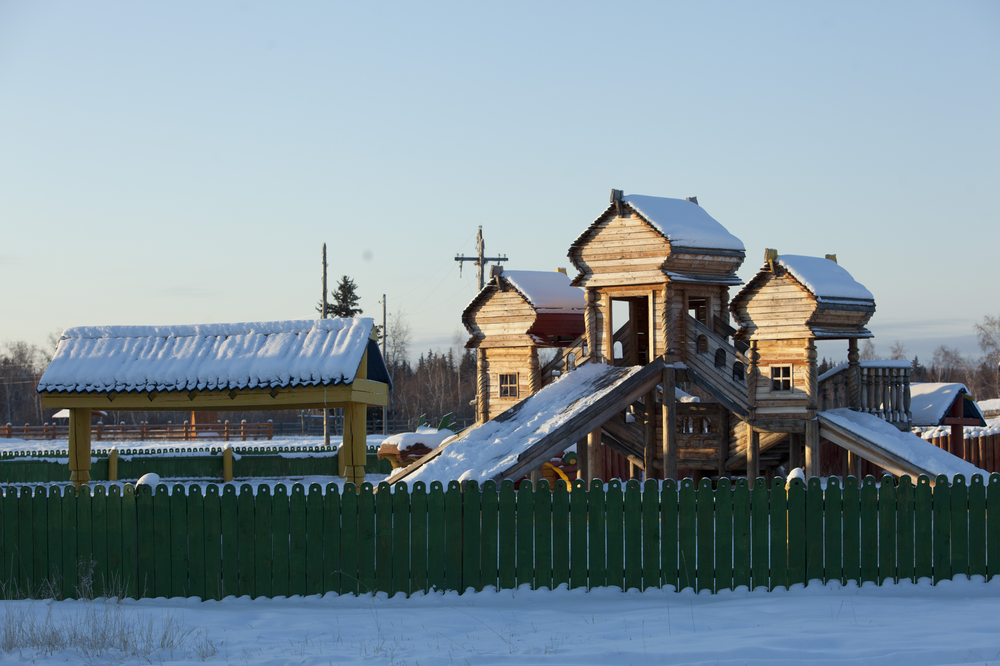

<h1 class="tc">
	Aligned Center
</h1>

### Туристическо-этнографо-архитектурный комплекс им. М.К. Аммосова в с. Хатырык Намского улуса

Представляем Вашему вниманию туристический этнографо-архитектурный комплекс «Урдук Иирэ» под открытым небом, который расположен на территории Хатырыкского наслега. Это единственная в республике полная реконструкция русской сибирской военной крепости 17 века, построенная традиционным способом. Туристический комплекс был построен в 2013 г. 

Композиционным центром комплекса является острог с пятью дозорными башнями, три из которых с вышками. Общая площадь этнографичекского комплекса – 2 332 кв.м., общая площадь земельного участка – 70 636 кв.м. Комплекс является музеем под открытым небом включает следующие строение: сибирский острог, 3 русские избы (гостевые дома), 2 якутских балагана на 120 мест, детская площадка, ворота «Дабайыы», «Тиитик», «Хаhыы», а также деревянные мосты над протоками реки Лена и гостевые дома. 

«Урдук Иирэ» предназначен для отдыха в экологическом чистом районе с комфортными условиями проживания, свежим воздухом, совмещает в себе удаленность от городской суеты и домашний уют в сочетании с красотами дикой природы. 

